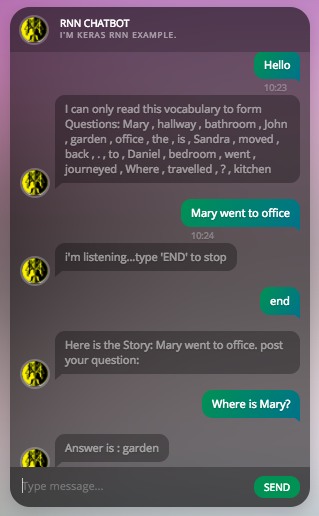

# Keras DMN Chatbot + Flask UI

This repository contain the Keras implementation of RNN to answer a range of babi tasks. Look at the references for a deep dive on each of the topics.

## References

**babi dataset!** : https://research.fb.com/downloads/babi/
**Keras Example!**: https://github.com/keras-team/keras/blob/master/examples/babi_rnn.py
**Flash UI bits**: https://github.com/suriyadeepan/easy_seq2seq
**DMN**: https://yerevann.github.io/2016/02/05/implementing-dynamic-memory-networks/


## Configuration

Current model is trained for a mere 15 mins, and as such you will not see appropriate response for the questions on the stories.

__To train the model__:
Set the Train parameter within **'model_config.ini'** to 'True'.
```
[strings]
train = True
```
Increase the number of epochs.
```
[ints]
epochs = 1000
```

__To Test the model__:
Set the Train parameter within **'model_config.ini'** to 'False'.
```
[strings]
train = False
```

## Running the Model
```python
python app.py
```

## UI Snapshots

